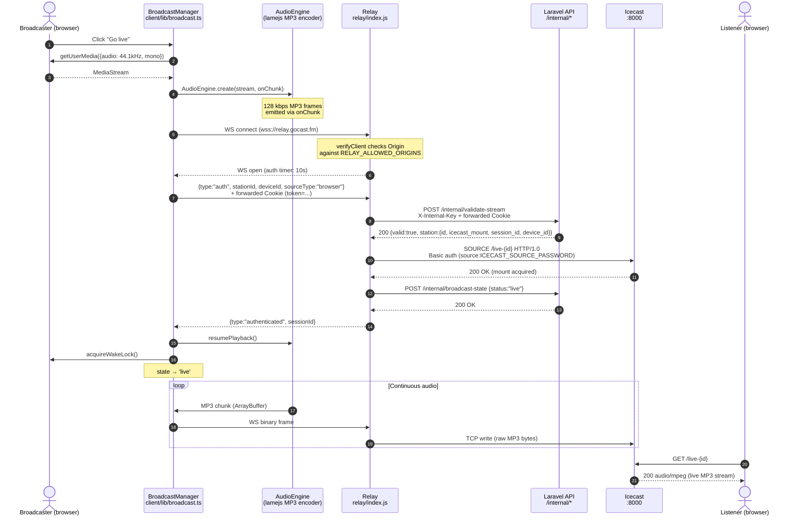
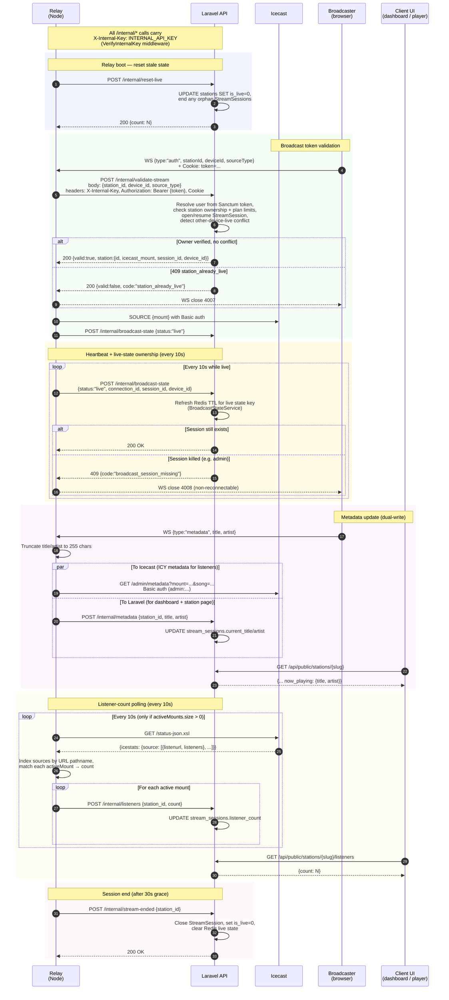
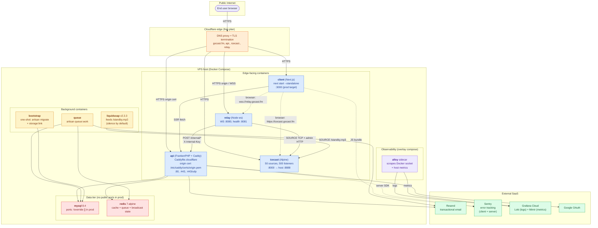

# GoCast — Architecture Flows

Four critical paths, each as a Mermaid diagram with short narration and jumping-off points into the code.

1. [Broadcasting Pipeline](#1-broadcasting-pipeline)
2. [Authentication Flow](#2-authentication-flow)
3. [API ↔ Relay Communication](#3-api--relay-communication)
4. [Deployment Architecture](#4-deployment-architecture)

---

## 1. Broadcasting Pipeline

### 1a. Happy path — "Go live" to first listener



**What happens:** The browser captures mic audio (no AGC/echo/noise — we want the DJ's mix as-is), encodes to 128 kbps MP3 frames in-browser via `lamejs`, and ships them as binary WebSocket frames. The relay's WS `verifyClient` rejects foreign Origins, then on the first `{type:"auth"}` message forwards the request (including the `token` cookie) to Laravel's `/internal/validate-stream`. Laravel checks the user owns the station, issues or resumes a `StreamSession`, and returns the Icecast mount path + source credentials embedded in the station payload. The relay opens a raw TCP SOURCE connection, and from then on it's a dumb pipe: WS binary in, TCP out. The `{type:"authenticated"}` message is what flips the client from `connecting` to `live`.

**Key files**
- `client/lib/broadcast.ts` — `BroadcastManager` state machine (connect → authenticate → stream → stop)
- `client/lib/audioEngine.ts` — lamejs MP3 encoder, playlist/mic mixing
- `relay/index.js:434-619` — WebSocket `connection` handler (`wss.on("connection")`)
- `relay/index.js:232-273` — `connectToIcecast()` raw TCP SOURCE handshake
- `api/app/Http/Controllers/StreamValidationController.php` — validates owner, mints session, returns mount
- `api/routes/api.php:96-103` — internal route group protected by `VerifyInternalKey`

---

### 1b. Disconnect and reconnect

```mermaid
sequenceDiagram
    autonumber
    participant BM as BroadcastManager
    participant R as Relay
    participant L as Laravel
    participant IC as Icecast
    actor LS as Listener

    Note over BM,R: WebSocket drops<br/>(network, tab backgrounded, etc.)
    R->>R: icecastSocket.destroy()
    R->>IC: TCP FIN on /live-{id}
    IC->>IC: Mount released,<br/>fallback-mount activates
    IC-->>LS: Transparently swap listener to /standby.mp3<br/>(Liquidsoap silence; no client reconnect)

    R->>L: POST /internal/broadcast-state {status:"reconnecting"}
    R->>R: Start 30s SESSION_END_GRACE_MS timer

    alt Broadcaster reconnects within 30s
        BM->>R: WS reconnect + {type:"auth"}
        R->>R: Cancel pendingSessionEnds timer
        R->>L: POST /internal/validate-stream
        L-->>R: 200 {station:...}
        R->>IC: SOURCE /live-{id} (retry on "Mountpoint in use")
        IC-->>R: 200 OK
        R->>L: POST /internal/broadcast-state {status:"live"}
        R-->>BM: {type:"authenticated"}
        Note over IC,LS: Listener transparently routed<br/>back to live mount
    else Grace window expires
        R->>L: POST /internal/stream-ended
        L->>L: Mark StreamSession ended,<br/>clear live state, station offline
        Note over LS: Listener keeps hearing /standby.mp3<br/>until they close the tab
    end
```

**What happens:** On any WS close (crash, network blip, tab suspended), the relay tears down the Icecast SOURCE immediately. Icecast's `<fallback-mount override="1">` on the mount transparently hands the listener off to `/standby.mp3` — the listener's audio element **does not reconnect**, it just keeps playing, now reading silence from the Liquidsoap feeder. The relay flips the API state to `reconnecting` and starts a 30 s timer. If the broadcaster comes back within the window (e.g. reloaded the tab), the new auth cancels the timer, re-acquires the mount, and flips state back to `live`. If the window expires, the relay calls `/internal/stream-ended`, Laravel closes the `StreamSession`, and the station shows offline. An intentional stop (close code 1000 or `{type:"stop"}`) skips the grace entirely (`graceMs = 0`).

**Key files**
- `relay/index.js:395-399` — `SESSION_END_GRACE_MS = 30000`, `pendingSessionEnds` map
- `relay/index.js:621-682` — `ws.on("close")` handler, schedules or cancels the session-end
- `relay/index.js:285-298` — `connectToIcecastWithRetry()` handles the brief "Mountpoint in use" window
- `infra/icecast/icecast.xml.tpl` — `<fallback-mount>/standby.mp3</fallback-mount>` + `override=1`
- `infra/liquidsoap/standby.liq` — standby feeder sourcing `blank()` by default
- `api/app/Http/Controllers/StreamEndedController.php` — clears live state on grace expiry
- `api/app/Services/BroadcastStateService.php` — Redis-cached live/reconnecting state

---

### 1c. Error paths

```mermaid
flowchart TD
    Start([User clicks Go live]) --> Mic{getUserMedia}
    Mic -- NotAllowedError --> E1[state: error<br/>&quot;Microphone access denied — check browser permissions&quot;]
    Mic -- NotFoundError --> E2[state: error<br/>&quot;No microphone found — plug one in and try again&quot;]
    Mic -- OK --> Enc[AudioEngine ready]

    Enc --> WS{WebSocket connect}
    WS -- onerror / onclose before auth --> E3[state: error<br/>&quot;Cannot connect to stream relay — is it running?&quot;]
    WS -- 25s no response --> E4[state: error<br/>&quot;Connection timed out — is the relay server running?&quot;]
    WS -- open --> Auth

    Auth[Send &#123;type:'auth'&#125;] --> AuthRes{Relay response}
    AuthRes -- close 4001 --> E5[&quot;Authentication timed out&quot;<br/>relay auth timer expired]
    AuthRes -- close 4003 --> E6[&quot;Authentication failed&quot;<br/>validate-stream 401/403]
    AuthRes -- close 4007 + type:error --> E7[&quot;This station is already live<br/>from another device.&quot;]
    AuthRes -- close 4004 --> E8[&quot;Could not connect to Icecast server&quot;<br/>SOURCE refused or timed out]
    AuthRes -- close 4009 --> E9[&quot;Could not synchronize broadcast state.<br/>Please try again.&quot;]
    AuthRes -- close 4005 mid-stream --> Reconnect[scheduleReconnect<br/>unless already stopping]
    AuthRes -- close 4008 --> E10[state: error NON_RECONNECTABLE<br/>&quot;Broadcast session ended&quot;]
    AuthRes -- close 4006 --> Kicked[Replaced by new connection<br/>— same user, different tab]
    AuthRes -- type:'authenticated' --> Live([state: live])

    Reconnect --> WS
```



**What happens:** Every failure converts to a typed close code (the 4000–4009 range is relay-defined) that the client maps to a human-readable message via `WS_CLOSE_REASONS`. Two close codes are special: `4006` means "another tab of yours just took over — don't reconnect, you were replaced" and `4008` means "Laravel lost your session (e.g. DB row gone) — don't reconnect, start fresh". Everything else in the authenticated state (`4005` from Icecast dropping, generic network loss) triggers `scheduleReconnect`, which waits for `visibilitychange` if the tab is backgrounded so a mobile user returning to the page gets a fresh connection instead of trying to reconnect in the background where the browser throttles timers. Mic errors never reach the relay — they're caught as `DOMException` in the `fail()` path before the WS even opens.

**Key files**
- `client/lib/broadcast.ts:23-33` — `NON_RECONNECTABLE_CLOSE_CODES` and `WS_CLOSE_REASONS`
- `client/lib/broadcast.ts:273-318` — `scheduleReconnect` / `attemptReconnect` with visibility gating
- `client/lib/broadcast.ts:380-413` — `fail()` maps `NotAllowedError`/`NotFoundError` to user copy
- `relay/index.js:445-450` — 10 s `AUTH_TIMEOUT_MS` fires close 4001
- `relay/index.js:492` — close 4007 for `station_already_live`
- `relay/index.js:507-512` — close 4006 for multi-device replacement (`_replaced` flag)
- `relay/index.js:555-560` — close 4008 when heartbeat detects `broadcast_session_missing`

---

## 2. Authentication Flow

### 2a. Registration + email verification

```mermaid
sequenceDiagram
    autonumber
    actor U as User
    participant C as Next.js client
    participant L as Laravel API<br/>(FrankenPHP)
    participant DB as MySQL
    participant Q as Redis queue
    participant M as Resend (mail)

    U->>C: Submit /auth/register form
    C->>L: POST /api/auth/register<br/>(name, email, password, password_confirmation)
    Note over L: throttle:auth (10/min/IP)
    L->>DB: users.insert (email_verified_at = null)
    L->>DB: personal_access_tokens.insert
    L->>Q: queue WelcomeNotification + VerifyEmailCode (6-digit)
    L-->>C: 200 {user, token}<br/>Set-Cookie: token=...; HttpOnly; SameSite=Lax<br/>Set-Cookie: user=...; (non-HttpOnly, UI hint)

    Q->>M: Dispatch VerifyEmailCode via Resend
    M-->>U: Email with 6-digit code

    U->>C: Enter code on verify screen
    C->>L: POST /api/email/verify {code}<br/>(auth:sanctum via token cookie)
    Note over L: throttle:10,1
    L->>DB: email_verification_codes lookup +<br/>users.email_verified_at = now()
    L-->>C: 204 No Content

    Note over U,L: User can now hit routes under<br/>auth:sanctum + verified middleware<br/>(station CRUD, uploads, sessions)
```

**What happens:** Registration is open — no invite codes, no ToS checkbox. The response sets two cookies: an `HttpOnly` `token` (the real Sanctum token, used for API auth via the `UseAuthTokenCookie` middleware which copies it into `Authorization: Bearer` on every request) and a non-HttpOnly `user` (JS-readable, gives the Next.js SSR an instant identity hint without an API roundtrip). Until `email_verified_at` is set, the user can still hit `/user`, `/logout`, `/account/*`, and the verification endpoints — but anything under the `verified` group (stations, sessions, uploads) returns `403 {code: "email_unverified"}`. The 6-digit code has its own table (`email_verification_codes`) with expiry, and `/email/resend` is throttled separately at 6/min so an attacker can't DoS Resend.

**Key files**
- `api/app/Http/Controllers/AuthController.php` — `register()`, `login()`, `logout()`, `user()`
- `api/app/Http/Controllers/EmailVerificationController.php` — `send()` / `verify()`
- `api/app/Http/Middleware/UseAuthTokenCookie.php` — bridges the `token` cookie into `Authorization: Bearer`
- `api/app/Notifications/VerifyEmailCode.php` — 6-digit email template
- `api/database/migrations/2026_04_21_120211_create_email_verification_codes_table.php`
- `api/routes/api.php:24-40` — auth route group with `throttle:auth`
- `client/app/auth/register/page.tsx` — registration form
- `docs/auth-flow.md` — sequence diagrams for all auth paths
- `docs/deployment-auth-cookies.md` — `SESSION_DOMAIN` guide for subdomain cookie sharing

---

### 2b. Login + middleware chain + Google OAuth + password reset

```mermaid
sequenceDiagram
    autonumber
    actor U as User
    participant C as Client
    participant L as Laravel
    participant G as Google OAuth
    participant DB as MySQL

    rect rgba(100, 149, 237, 0.1)
    Note over U,DB: Password login (throttled)
    U->>C: /auth/login submit
    C->>L: POST /api/auth/login (email, password)
    Note over L: throttle:auth +<br/>per-account lockout after 5 fails
    L->>DB: users.where(email) + Hash::check
    alt Lockout triggered
        L-->>C: 429 {lockout_seconds}
    else Success
        L->>DB: personal_access_tokens.insert<br/>+ authentication_log row
        L-->>C: 200 + Set-Cookie token, user
    end
    end

    rect rgba(144, 238, 144, 0.1)
    Note over U,G: Google OAuth (stateless)
    U->>C: Click "Continue with Google"
    C->>L: GET /api/auth/google
    L->>L: Generate state, SHA256-hash it
    L-->>C: 302 → accounts.google.com<br/>Set-Cookie: gocast_oauth_state=hash; HttpOnly; 10min
    C->>G: Follow redirect, user consents
    G-->>C: 302 → /api/auth/google/callback?code&state
    C->>L: GET /api/auth/google/callback
    L->>L: hash_equals(cookie, sha256(state))
    L->>G: Exchange code → user profile
    L->>DB: users.firstOrCreate (link google_id,<br/>auto-set email_verified_at)
    L->>DB: personal_access_tokens.insert
    L-->>C: 302 + Set-Cookie token, user
    end

    rect rgba(255, 182, 193, 0.1)
    Note over U,L: Password reset
    U->>C: /auth/forgot submit
    C->>L: POST /api/auth/password/forgot {email}
    Note over L: throttle:3,1 (3/min/IP)
    L->>DB: If user exists, store reset code
    L-->>C: 200 always (enumeration-proof)
    L-->>U: Email with 6-digit reset code
    U->>C: Enter code + new password
    C->>L: POST /api/auth/password/reset
    Note over L: throttle:10,1
    L->>DB: Validate code, update password,<br/>revoke existing tokens
    L-->>C: 200 + new Set-Cookie token
    end

    rect rgba(255, 215, 0, 0.1)
    Note over C,L: Protected request middleware chain
    C->>L: GET /api/stations (Cookie: token=...)
    L->>L: UseAuthTokenCookie:<br/>copies cookie → Authorization header
    L->>L: auth:sanctum:<br/>validates token against personal_access_tokens
    L->>L: verified:<br/>checks email_verified_at IS NOT NULL
    alt Verified
        L-->>C: 200 {data: [...]}
    else Unverified
        L-->>C: 403 {code: "email_unverified"}
    end
    end
```

**What happens:** Password login uses two layers of throttling — `throttle:auth` caps IPs at 10/min, and a per-account counter locks a specific email after 5 bad tries (so a distributed attacker hitting many IPs still can't brute-force one account). Google OAuth is stateless: the CSRF state is hashed with SHA-256 and the hash lives in an HttpOnly cookie (`gocast_oauth_state`) for 10 minutes; `hash_equals` constant-time compares it on callback — no server-side session needed. If the Google email matches an existing user, the account is linked by `google_id`; either way email is auto-verified. Password reset is symmetric with email verification (6-digit code, separate table, separate throttle) and the `/forgot` endpoint **always returns 200** so an attacker can't probe which emails are registered. Every authenticated API hit walks three middlewares in order: cookie→header bridging, Sanctum token check, and optional `verified` gate.

**Key files**
- `api/app/Http/Controllers/AuthController.php` — login with per-account lockout
- `api/app/Http/Controllers/GoogleAuthController.php` — redirect + callback with hashed state cookie
- `api/app/Http/Controllers/PasswordResetController.php` — enumeration-proof `/forgot`
- `api/app/Http/Middleware/UseAuthTokenCookie.php` — cookie → `Authorization: Bearer`
- `api/config/sanctum.php` — token validation config
- `api/routes/api.php:24-76` — auth group, auth:sanctum group, verified sub-group
- `client/app/auth/login/page.tsx` / `client/app/auth/callback/page.tsx`
- `docs/auth-flow.md` — authoritative sequence diagrams

---

## 3. API ↔ Relay Communication



**What happens:** All relay ↔ API traffic goes through the `/internal/*` route group and is authenticated by a shared `INTERNAL_API_KEY` (verified by the `internal` middleware alias on the route group). The relay forwards the broadcaster's cookie on `validate-stream` so Laravel can resolve the real user via Sanctum — this is the only internal call that needs real user auth; the rest rely on the shared secret. The heartbeat (every 10 s) is how Laravel knows the relay still owns the live state: if Laravel responds `broadcast_session_missing`, the relay kicks the broadcaster with close code 4008 (non-reconnectable) because the session row is gone and replaying would be inconsistent. Metadata is a dual-write — Icecast gets it via the admin `/admin/metadata` endpoint for in-stream ICY metadata (what the listener's audio element parses), and Laravel gets it for the public-page "now playing" display. Listener counts are only polled while mounts are active, indexed by URL *pathname* (not substring match on `listenurl`, which would conflate `/stream/foo` and `/stream/foo-2`).

**Key files**
- `relay/index.js:99-221` — `startBroadcast`, `updateMetadata`, `updateListenerCount`, `updateBroadcastState`, `notifyStreamEnded`, `resetLiveStations`
- `relay/index.js:340-372` — `startListenerPolling()`, the 10 s Icecast stats poll
- `relay/index.js:552-572` — 10 s `broadcastStateInterval` heartbeat
- `api/app/Http/Controllers/StreamValidationController.php` — token + ownership check
- `api/app/Http/Controllers/BroadcastStateController.php` — heartbeat receiver, returns `broadcast_session_missing`
- `api/app/Http/Controllers/UpdateMetadataController.php` — dashboard/player metadata write
- `api/app/Http/Controllers/UpdateListenerCountController.php` — listener-count sink
- `api/app/Http/Controllers/StreamEndedController.php` — end-of-session cleanup
- `api/app/Http/Controllers/ResetLiveStationsController.php` — boot-time cleanup
- `api/app/Http/Middleware/VerifyInternalKey.php` — `X-Internal-Key` gate
- `api/app/Services/BroadcastStateService.php` — Redis-cached live/reconnecting state

---

## 4. Deployment Architecture



**What happens:** Four subdomains point at the same VPS, all behind Cloudflare's proxy: `gocast.fm` (Next.js), `api.gocast.fm` (FrankenPHP + Caddy, using a Cloudflare Origin Certificate mounted at `/etc/caddy/certs/origin.{pem,key}`), `relay.gocast.fm` (Node WS, TLS terminated at the edge by Cloudflare), and `icecast.gocast.fm` (Icecast, same story). The `bootstrap` service is a one-shot that blocks `api`, `queue`, and the rest via `service_completed_successfully` — it runs `artisan migrate --force && storage:link --force` on every `up`, so a fresh VPS boots into a ready state without manual intervention. `docker-compose.prod.yml` uses `!override []` to actually remove the MySQL and Redis host ports (without the tag, Compose would concatenate the list and the ports would stay exposed — the single line that secures the data tier). `NEXT_PUBLIC_*` vars are **build args**, not runtime env — changing them requires rebuilding the client image. Observability is an opt-in overlay (`docker-compose.observability.yml`) that starts a Grafana Alloy sidecar reading the Docker socket for logs and host metrics, shipping both to Grafana Cloud with credentials from `.env`.

**Key files**
- `docker-compose.yml` — full dev stack (mysql, redis, icecast, liquidsoap, api, bootstrap, queue, relay, client)
- `docker-compose.prod.yml` — prod override: `!override` removes dev mounts/ports, swaps `Caddyfile.cloudflare`, inlines `NEXT_PUBLIC_*` as build args
- `docker-compose.observability.yml` — Alloy sidecar for Grafana Cloud log/metric shipping
- `api/Dockerfile` — multi-stage (dev / prod), FrankenPHP base, `opcache.validate_timestamps=0` in prod
- `api/Caddyfile` — dev: plain HTTP; direct-TLS prod mode with Let's Encrypt auto-cert
- `api/Caddyfile.cloudflare` — prod: Cloudflare Origin Cert + `trusted_proxies cloudflare`
- `client/Dockerfile` — multi-stage, prod stage serves `.next/standalone` output
- `infra/icecast/Dockerfile` + `infra/icecast/icecast.xml.tpl` — Alpine Icecast with env-templated config
- `infra/icecast/entrypoint.sh` — `envsubst` renders `icecast.xml` at container start
- `infra/liquidsoap/standby.liq` — standby-bed feeder
- `infra/alloy/config.alloy` — log/metric pipeline to Grafana Cloud
- `infra/certs/` — mount point for Cloudflare Origin Certificate (gitignored)
- `.env.docker.example` — every required env var, inc. `SERVER_NAME`, `*_HOSTNAME`, `GRAFANA_CLOUD_*`, `SENTRY_*`, `INTERNAL_API_KEY`
- `relay/index.js:40-63` — env-driven config for all external endpoints
