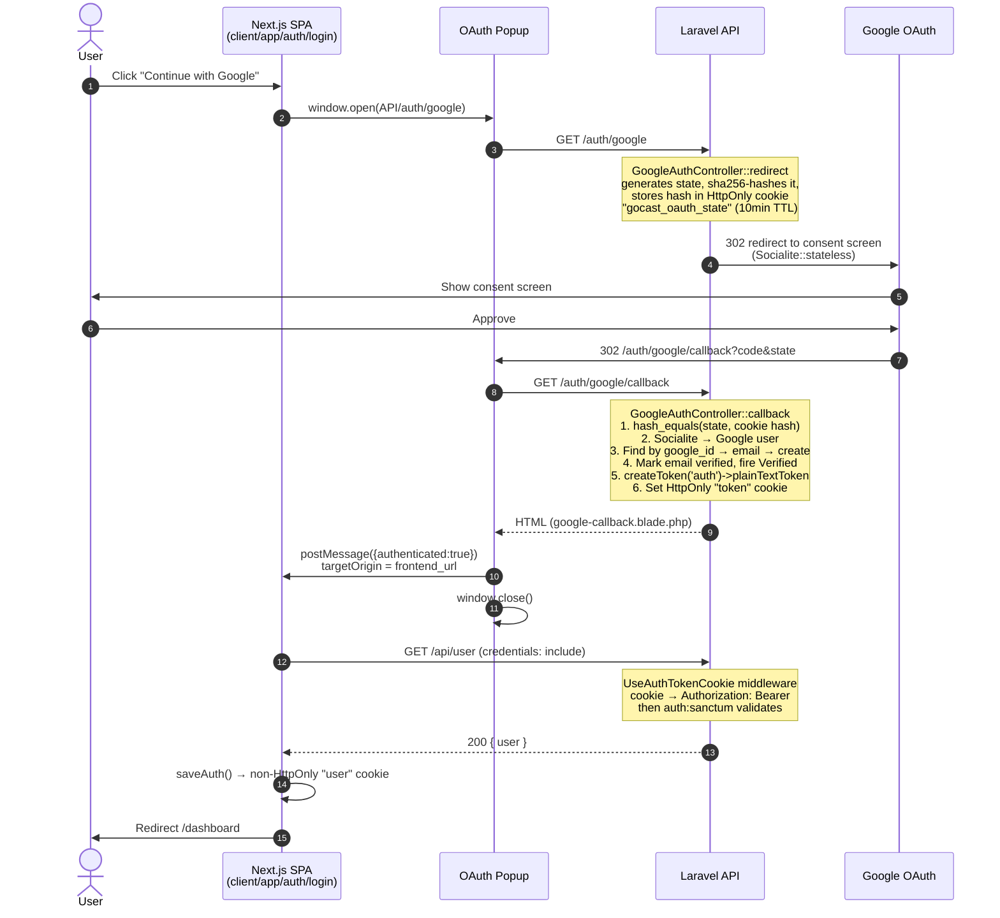
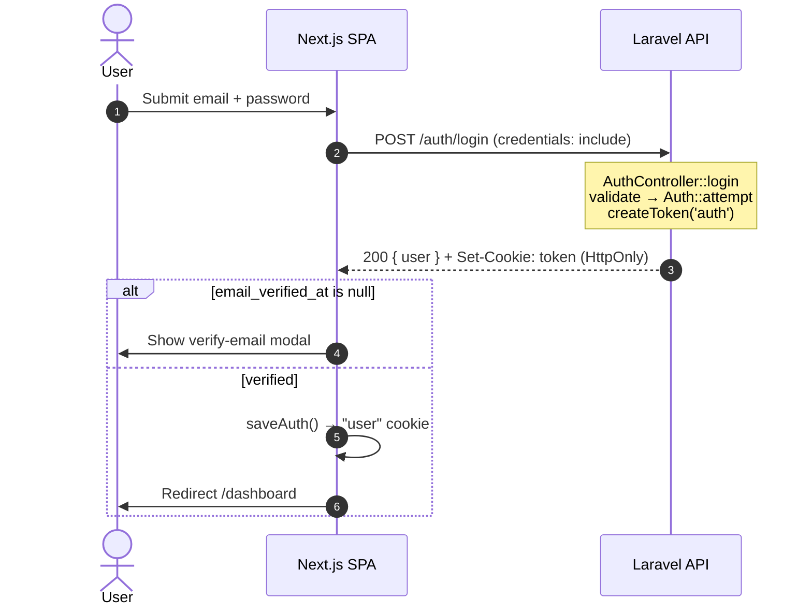
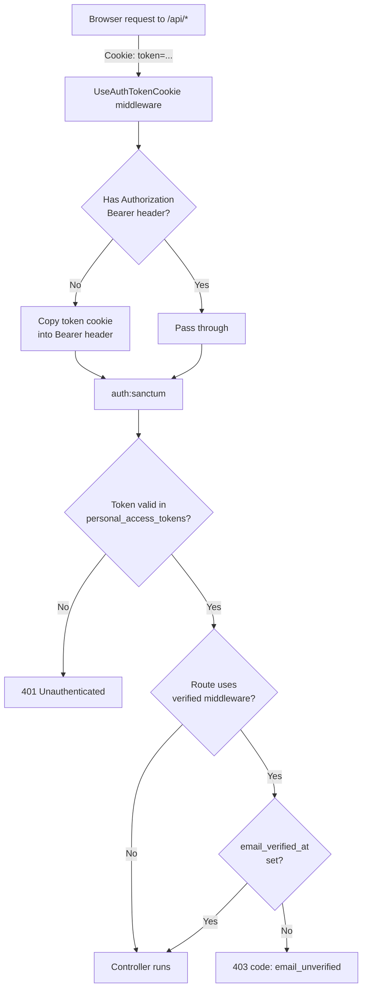

# Auth Flow

Sanctum cookie-based authentication with Google OAuth and email/password login.
API is at a separate origin from the Next.js SPA, so auth uses a stateless OAuth
state cookie and an HttpOnly `token` cookie carrying the Sanctum plaintext token.

## 1. Google OAuth Login



## 2. Password Login



## 3. Authenticated API Request (middleware chain)



## 4. Logout

```mermaid
sequenceDiagram
    autonumber
    actor U as User
    participant SPA as Next.js SPA
    participant API as Laravel API

    U->>SPA: Click logout
    SPA->>API: POST /api/logout (Bearer via cookie)
    Note over API: AuthController::logout<br/>currentAccessToken()->delete()<br/>forgetAuthCookie()
    API-->>SPA: 204 + Set-Cookie: token=; Max-Age=0
    SPA->>SPA: clearAuth() — remove "user" cookie
    SPA->>U: Redirect /auth/login
```

## Notes

- **Dual-cookie strategy**: HttpOnly `token` (security, not JS-readable) + non-HttpOnly `user` (instant UI state, no API roundtrip on page load).
- **Cross-domain OAuth**: `Socialite::stateless()` + signed state cookie — no server session.
- **Email verification**: auto-verified on Google login; required before accessing `verified`-gated routes for password accounts.
- **Account linking**: Google callback links `google_id` onto an existing email-matched account if found.
- See also: [deployment-auth-cookies.md](./deployment-auth-cookies.md) for `SESSION_DOMAIN` setup across subdomains.
